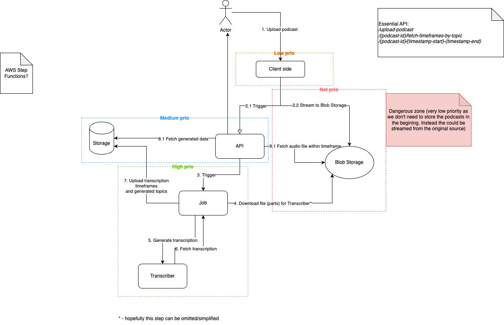

# Project “Podcut”
## Status: the research is outdated, the idea might be relevant though...

### _“Many hear, but you listen”_

## Idea:

App provides the following possibilities:

- User selects favorite topic of podcasts they interested about (e.g. movie, evolutionary psychology, history) AND/OR interesting people (e.g. Huberman)
- App scans (with AI) the topics considering the user preferences
- App suggests the time frames (cuts around 5min) to listen to, with reference to the whole episode (e.g. Huberman - Mental Health [HardWork]: 02.21 - 05.10). The idea of TikTok might be a reference...

## Business:

Why:

- Should provide boost of plays for podcaster due to easier consumption of content (also not skipping or abandoning whole episodes)
- Should also keep old podcast more relevant since cuts will be grouped by topic (not by date) considering the user preference

For whom:

- Young people willing to improve themselves with a shorter attention span
- People who are interested in a specific topics/ideas but not in in a podcaster or guest themselves

## Competitors:

- [Snipd](https://www.snipd.com/) - Covers some parts of this idea (not the categorizing functionality, e.g. listening to the "Wealth" category cuts)

## Plan

### MVP:

- AI Integration
  - Provide audio file to generate timeframes (start and end of topic/label) - DONE
  - Generate labels and categories for uploaded podcasts - DONE
  - Connect labels with found timeframes
  - Connect user categories (preferences) with labels to provide suggestions
    Category (psychology) => Labels (Mental Toughness, Openness) => Suggested Cuts (Timestamps start-end)

## Architecture

## Providers

### Transcription

[whisperx](https://github.com/m-bain/whisperX) is a way to go! It provides:

- transcription
- speaker detection

### AI text generation

Chat GPT 4 ([pricing](https://help.openai.com/en/articles/7127956-how-much-does-gpt-4-cost)). Also using the plan for 128k tokens should be more than enough to handle even long podcasts (~96k words while ~6min of tested podcast is ~1200 words while ~6min of tested podcast is ~1200 words)

## Later improvements:

- Podcut suggestions might consider user’s average attention span (might also increase uses’s attention by slowly providing longer cuts)
- Likes to promote the cut to the top
- Engine to provide the suggestions

### _For more check the docs folder_
